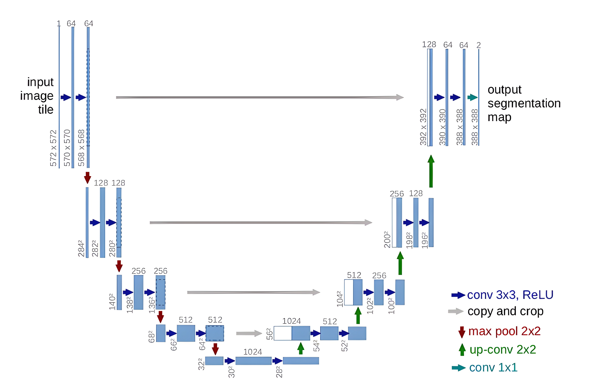

<!DOCTYPE html>
<html>

<body>
	<h1>U-Net Model Implementation</h1>
	
This repository contains the code for the U-Net architecture, a popular convolutional neural network used for image segmentation. The code is implemented in Python and uses the PyTorch framework.

	<h2>U-Net Architecture</h2>
	
	<h2>Installation</h2>
	
To install the dependencies required for this code, run the following command:

	<pre><code>pip install -r requirements.txt</code></pre>
	<h2>Usage</h2>
	
To use the U-Net architecture, follow these steps:

	<ol>
		<li>Prepare your data by organizing it into two folders: one for images and one for their corresponding masks.</li>
		<li>Update the `data_dir` variable in `train.py` and `test.py` to point to the location of your data.</li>
		<li>Run `train.py` to train the model. You can adjust the hyperparameters in this file to optimize performance.</li>
		<li>Run `test.py` to generate predictions on a new set of images.</li>
	</ol>
	<h2>Credits</h2>
	
This code was developed by Yash Bhootda. If you find this repository useful, please consider giving it a star on GitHub!

</body>
</html>
